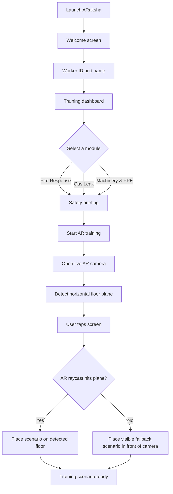

# ARaksha — AR Safety Training Simulator

ARaksha is an Android augmented-reality safety-training prototype for **SIH26041**. It gives industrial trainees a mobile, offline-friendly way to practise safety scenarios such as fire response, gas-leak awareness, and PPE readiness.

Built with Unity 6, AR Foundation, and ARCore, the app detects a floor through the phone camera and lets a trainee tap to place a 3D safety-training scenario in the real environment.

## Features

- Android AR training using ARCore plane detection and raycasting.
- Camera-backed floor scanning with tap-to-place training scenario placement.
- Worker ID and name entry, retained for the current training session.
- Responsive mobile UI designed around a 1080 × 1920 reference layout.
- Safety-training home screen with Fire Response, Gas Leak, and Machinery/PPE modules available.
- Offline-first prototype flow with no server dependency.
- Visible fallback safety marker when an imported `.glb` scenario model is not yet configured.

## Project flow

##   Architecture

| Area | Responsibility |
| --- | --- |
| `Assets/ARS/App` | App navigation, sign-in flow, dashboard, AR placement controller |
| `Assets/ARS/UI` | Code-built mobile UI, Canvas scaling, colors, buttons, and input fields |
| `Assets/ARS/Core` | App constants and localization support |
| `Assets/ARS/Data` | Local in-memory storage abstraction |
| `Assets/Scenes/SampleScene.unity` | AR Session and XR Origin scene |

## Requirements

- Unity **6.3 LTS (6000.3.25f1)**
- Android Build Support, Android SDK & NDK Tools, and OpenJDK
- ARCore-capable Android device with camera permission enabled
- A well-lit floor with visible texture for reliable plane detection

## Run in the Unity Editor

1. Open this directory in Unity Hub using Unity `6000.3.25f1`.
2. Open `Assets/Scenes/SampleScene.unity`.
3. Wait for package import and script compilation to complete.
4. Select Android as the active Build Profile.
5. Use **Build And Run** with an ARCore-capable device connected by USB.

## Android test flow

1. Enter a Worker ID and trainee name.
2. Choose any training module.
3. Select **Start AR training**.
4. Allow camera permission.
5. Move the device over a well-lit, textured floor until plane dots appear.
6. Tap the camera view to place or reposition the training scenario.

## 3D models

The source `.glb` assets are intentionally excluded from Git because the model archive is large. Keep them in `SourceModels/` locally, then import the desired assets into Unity using glTFast before assigning them to production training scenarios. The current project includes a code-built fallback marker so AR placement remains testable without committing large binaries.

## Repository hygiene

Unity-generated folders (`Library`, `Temp`, `Logs`, `obj`, `UserSettings`) and Android build artifacts are ignored. Only source code, Unity assets, packages, settings, and documentation are tracked.
